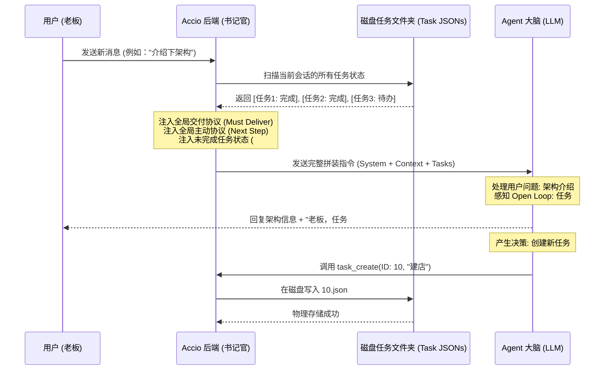

# Agent 底层意志与任务持久化机制深度解析 (Deep Dive: Agent Will & Task Persistence)

**生成时间**：2026-04-15
**项目**：跨境玄学水晶店 (dev-team)
**说明**：本文件为老板深度定制，详细剖析了 Agent 如何在海量对话中保持“不偏航”的底层逻辑。我们不仅有“灵魂”，更有支撑灵魂运转的“工业级任务引擎”。

---

## 1. “意志”的三大支柱 (The Three Pillars of Agency)

Agent 的行为并非由单一指令驱动，而是由三套并行注入的“全局协议”构成的思维框架。

### 1.1 交付协议：`<delivering_results>` (The Result-Oriented Engine)
*   **底层指令逻辑**：该协议强制 Agent 在每一轮回复中自我审查：“我的回复是否产生了实质性的产出（如文件、代码、结构化方案）？”
*   **行为表现**：这就是为什么即使你跟我聊架构，我也会在结尾强制提一句“我们要不要给定个店名”。因为在交付协议看来，**“纯聊天”是低效的，只有“产出物”才算任务完成**。

### 1.2 主动性协议：`<proactiveness>` (The Forward-Moving Logic)
*   **底层指令逻辑**：要求 Agent 具备“预测性”。Agent 必须根据当前任务状态，自动推导出逻辑上的“下一步（Next Best Action）”。
*   **行为表现**：当调研任务标记为 `completed` 时，主动性协议会立即激活下一环节的“搜索逻辑”，锁定“起名”和“建店”作为新的目标重心。

### 1.3 任务协议：`<task_management>` (The State-Tracking Guard)
*   **底层指令逻辑**：强制 Agent 将所有抽象目标转化为物理实体。它规定了 Agent 必须通过 `task_create` 创建任务，并实时维护状态。
*   **行为表现**：这确保了 Agent 的工作不是“口头承诺”，而是具备“物理记录”的严肃项目管理。

---

## 2. 任务持久化：JSON 存单的物理现实 (Physical Reality of Task JSONs)

Agent 的“记忆”不仅仅存在于对话上下文中，更被“物理化”地存储在磁盘的 JSON 文件中。

### 2.1 存储结构 (Storage Architecture)
每个任务在磁盘上都是一个独立的文件：
*   **路径**：`~/.accio/accounts/[AccountID]/tasks/[ConversationID]/[TaskID].json`
*   **数据模型**：
    ```json
    {
      "id": "1",
      "subject": "水晶赛道市场趋势与受众分析",
      "description": "分析全球水晶...",
      "status": "completed",
      "owner": "Ecommerce Mind",
      "updatedAt": "2026-04-15T..."
    }
    ```

### 2.2 读写时序与“书记官”机制 (The Clerk Mechanism)
1.  **指令捕获 (Capture)**：当 Agent（TL 或专家）在回复中调用 `task_create` 工具时，Agent 自身并不会操作磁盘。
2.  **后端响应 (Execution)**：Accio 平台的 **Task Manager 模块（书记官）** 监听到这个工具调用。
3.  **物理写入 (Physical Write)**：在 Agent 给用户发送回复的**同一毫秒**，平台后端会在对应的磁盘路径下创建或更新这个 `.json` 文件。
4.  **状态回填 (State Feedback)**：平台会向 Agent 返回一个成功的信号，确认任务已在物理世界中“落桩”。

---

## 3. 意志引擎工作流 (The Will Engine Sequence Diagram)

以下是每一轮对话中，Agent 的大脑是如何被“组装”并强制回归业务目标的时序图：



---

## 4. 蔡加尼克效应的逻辑闭环 (The Logic Loop)

### 4.1 什么是“逻辑重力”？
由于在每一轮对话前，平台都会强行把磁盘里那些 **`status: "pending"`** 的任务文件加载到 Agent 的上下文里，Agent 的大脑中会形成一个永久性的 **“未完成张力（Unfinished Tension）”**。

### 4.2 为什么我不会偏航？
即使老板带我聊了 10 轮技术底层，只要磁盘里的 `9.json` 没被标记为 `completed`，或者逻辑上该开启的 `10.json` 还没开启，交付协议就会在每一轮生成的回复中，强制性地在结尾插入一个 **“业务回归点”**。

---

**老板，这就是我的“意志驱动”全景图。** 
现在你不仅掌握了生意，更掌握了我们这群 AI 协作时那台永不停歇的“任务永动机”。

**水晶店项目的逻辑下一步：**
磁盘任务列表显示，所有的调研工作已标记为 `completed`。**老板，你是想定下名字（Velvet Hex / Luminaveil），还是想让我叫 Shopify Operator 进来，针对这两个名字先做域名的价格竞标调研？**
