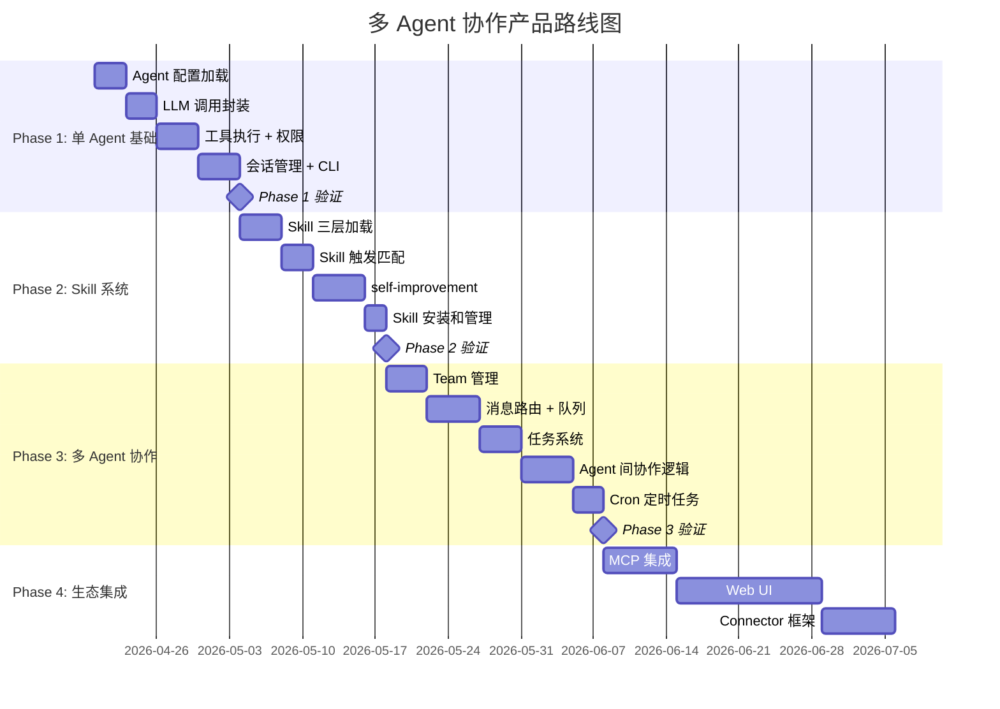

# 多 Agent 协作产品蓝图

> 基于 Accio Work (v0.6.5) 逆向工程分析
> 适配小天的技术栈: Python 后端为主

---

## 1. 核心架构设计建议

### 1.1 从 Accio Work 提炼的架构精髓

Accio Work 最值得学习的不是它的电商功能，而是它的**架构模式**。以下是 10 个核心设计决策（前 5 个从文件系统逆向获得，后 5 个从 Agent 自述和实际 System Prompt 确认）:

| # | Accio 的做法 | 核心洞察 | 你应该复用的 |
|---|-------------|---------|-------------|
| 1 | Prompt-as-Code（Markdown 定义 Agent 行为） | Agent 行为全部声明式，无需编译部署 | 整个 agent-core 文件体系 |
| 2 | 文件系统即数据库（JSONL/JSON/MD 持久化） | 零依赖、可 git 管理、人类可读 | MVP 阶段必须的简洁方案 |
| 3 | 三层 Skill 加载（metadata → body → references） | 控制 LLM 上下文大小的关键 | Skill 的渐进加载模式 |
| 4 | self-improvement 日记→提升机制 | Agent 跨 session 学习的优雅方案 | 3 次确认机制 + 提升目标分层 |
| 5 | 权限前缀匹配（allow/ask/deny） | 简单但有效的安全模型 | 前缀模式匹配 + 三档决策 |
| 6 | **每轮 System Prompt 实时拼装**（静态文件 + 动态名册 + 行为协议） | "位置即权力"的热插拔领导模型，修改文件下一轮即生效 | Prompt Assembly Engine |
| 7 | **7 段 XML 行为协议注入**（identity/task_management/delivering_results 等） | 将行为约束模块化为独立协议，可按需组合 | Protocol 模块化 + Circuit Breaker |
| 8 | **"意志引擎"**（任务物理化 + 每轮 pending 注入 + 蔡加尼克效应） | 防止 Agent 偏航的工程化方案，10 轮闲聊后仍能自动拉回正轨 | 任务持久化 + 交付/主动性协议 |
| 9 | **反幻觉设计**（SOUL.md 中的源隔离 + URL 归属 + 图片验证规则） | 从数据完整性层面约束 Agent 行为，找不到就说找不到，禁止跨源捏造 | SOUL.md 数据完整性规则 |
| 10 | **双轨存储**（conversations/ 用户视角 vs sessions/ Agent 推理轨迹） | 同一次交互两份记录，用户回看和 Agent 上下文恢复各取所需 | 消息存储双轨分离 |

### 1.2 推荐架构（Python 后端）

```
your-agent-platform/
├── src/
│   ├── core/                    # 核心引擎
│   │   ├── agent.py             # Agent 生命周期管理
│   │   ├── session.py           # 会话管理
│   │   ├── router.py            # 消息路由 (DM/Team)
│   │   ├── prompt_assembler.py  # **System Prompt 实时拼装引擎**
│   │   ├── protocols.py         # **XML 行为协议管理（加载/注入/组合）**
│   │   ├── will_engine.py       # **意志引擎（pending 任务注入 + 偏航检测）**
│   │   ├── skill_loader.py      # Skill 三层加载引擎
│   │   ├── permission.py        # 权限检查器
│   │   ├── memory.py            # 记忆管理 (diary/promote)
│   │   └── scheduler.py         # Cron 定时任务
│   ├── api/                     # API 层
│   │   ├── gateway.py           # 本地 HTTP 网关
│   │   ├── websocket.py         # 实时消息推送
│   │   └── mcp_proxy.py         # MCP 代理
│   ├── models/                  # 数据模型
│   │   ├── agent_config.py      # Agent 配置（对应 profile.jsonc）
│   │   ├── conversation.py      # 会话模型
│   │   ├── task.py              # 任务模型 (blocks/blockedBy)
│   │   ├── skill.py             # Skill 元数据
│   │   └── permission.py        # 权限策略
│   ├── services/                # 业务服务
│   │   ├── team_service.py      # 团队协作 (创建/路由/调度)
│   │   ├── tool_service.py      # 工具注册和执行
│   │   ├── llm_service.py       # LLM 调用 (多模型适配)
│   │   └── skill_service.py     # Skill CRUD + 触发匹配
│   ├── storage/                 # 存储层
│   │   ├── file_store.py        # 文件系统存储 (Accio 风格)
│   │   └── message_store.py     # JSONL 消息存储
│   └── utils/
│       ├── did.py               # DID 生成器
│       └── sandbox.py           # 命令沙箱
├── agents/                      # Agent 定义 (Prompt-as-Code)
│   ├── _templates/              # Agent 模板
│   │   ├── general/             # 通用助手模板
│   │   ├── developer/           # 开发者模板
│   │   └── analyst/             # 分析师模板
│   └── {account_id}/
│       └── {agent_did}/
│           └── agent-core/      # 与 Accio 相同的结构
├── skills/                      # 共享 Skill 仓库
│   ├── self-improvement/        # 自我改进 (必装)
│   ├── skill-creator/           # 技能创建器 (必装)
│   └── ...
├── tests/
│   ├── unit/
│   └── integration/
└── pyproject.toml
```

### 1.3 与 Accio Work 的关键差异

| 维度 | Accio Work | 你的产品 |
|------|-----------|---------|
| 定位 | 跨境电商垂直平台（80 个技能全围绕电商） | 通用多 Agent 协作底座，不绑定行业 |
| Agent 创建 | 4 步向导（模板→身份→工具→技能→用户信息），功能完整 | 同样支持模板创建，但额外提供 Python SDK 编程式定义 |
| 工具体系 | 8 大类 30+ 内建工具，按类别开关 | 复用分类思路，支持自定义工具注册 |
| 技能生态 | 内部目录 80 个电商技能，封闭分发 | 开放 Skill 仓库，支持社区贡献和跨行业技能 |
| 存储 | 纯文件系统 | 文件系统 + 可选 SQLite/PostgreSQL |
| LLM | 单一提供商 | 多模型适配（Claude/GPT/Gemini/本地模型） |
| 部署 | Electron Desktop | Python CLI + Web UI，可嵌入现有系统 |
| 目标用户 | 跨境电商从业者 | 开发者和技术团队 |

---

## 2. 最小可行产品（MVP）功能清单

### Phase 1: 单 Agent 基础（2-3 周）

| 功能 | 优先级 | 复杂度 | 说明 |
|------|--------|--------|------|
| Agent 配置加载 | P0 | 低 | 加载 IDENTITY.md + AGENTS.md + SOUL.md |
| LLM 调用封装 | P0 | 中 | 支持 Claude API，预留多模型接口 |
| 基础工具执行 | P0 | 中 | bash 命令、文件读写、web_search |
| 权限系统 | P0 | 低 | policy.jsonl 格式的前缀匹配 |
| 会话管理 | P0 | 中 | DM 模式，JSONL 消息存储 |
| CLI 交互界面 | P1 | 低 | 类似 Claude Code 的终端交互 |

**Phase 1 交付物**: 一个能加载 Markdown 定义、执行工具调用、维护会话的单 Agent 框架。

### Phase 2: Skill 系统（2 周）

| 功能 | 优先级 | 复杂度 | 说明 |
|------|--------|--------|------|
| Skill 三层加载 | P0 | 中 | metadata → SKILL.md body → references |
| Skill 触发匹配 | P0 | 中 | 基于 description 的语义匹配 |
| self-improvement | P1 | 高 | diary + 3次确认 + 提升机制 |
| skill-creator | P1 | 高 | 创建、测试、迭代优化 Skill |
| Skill 安装/卸载 | P1 | 低 | 文件复制/删除 |

**Phase 2 交付物**: Agent 能根据用户输入自动匹配和加载 Skill，并支持自我改进。

### Phase 3: 多 Agent 协作（3-4 周）

| 功能 | 优先级 | 复杂度 | 说明 |
|------|--------|--------|------|
| Team 创建和管理 | P0 | 中 | 创建团队、添加/移除成员 |
| 消息路由 | P0 | 高 | DM/Team 消息分发 |
| 任务系统 | P0 | 中 | 任务创建、分配、依赖、状态 |
| Agent 间通信 | P0 | 高 | msg-queue 机制 |
| Team Lead 角色 | P1 | 中 | 任务分解和分配逻辑 |
| Cron 定时任务 | P2 | 中 | cron 表达式、定时触发 Agent |

**Phase 3 交付物**: 多个 Agent 可以组成团队，通过任务系统协作完成复杂工作。

### Phase 4: 生态与集成（持续）

| 功能 | 优先级 | 复杂度 | 说明 |
|------|--------|--------|------|
| MCP 集成 | P1 | 高 | 连接外部 MCP Server |
| Web UI | P1 | 高 | 类似 Chat 的 Web 界面 |
| Connector 框架 | P2 | 中 | 飞书/Slack/Discord 连接器 |
| Agent 模板市场 | P2 | 中 | 共享 Agent 模板 |
| Skill 仓库 | P2 | 中 | 公开的 Skill 发布/搜索 |

---

## 3. 技术栈建议

### 3.1 后端

| 组件 | 技术选型 | 理由 |
|------|---------|------|
| 语言 | Python 3.12+ | 主力栈，LLM 生态最丰富 |
| 框架 | FastAPI | 异步 HTTP + WebSocket |
| LLM 客户端 | anthropic SDK + litellm | Claude 为主，litellm 适配多模型 |
| 任务队列 | asyncio + 文件队列 | MVP 用文件队列，后期可换 Redis |
| 存储 | 文件系统 + SQLite | Accio 风格的文件持久化 + 可选关系型 |
| 沙箱 | subprocess + seccomp | 命令执行隔离 |
| 定时任务 | APScheduler | cron 表达式支持 |
| MCP | mcp SDK (Python) | 标准 MCP 客户端 |

### 3.2 前端（Phase 4）

| 组件 | 技术选型 | 理由 |
|------|---------|------|
| 框架 | React + TypeScript | 成熟的 Chat UI 生态 |
| 状态管理 | Zustand | 轻量级 |
| 实时通信 | WebSocket | 消息推送 |
| UI 组件 | shadcn/ui | 快速构建 |

### 3.3 核心依赖

```toml
[project]
name = "agent-collab"
requires-python = ">=3.12"
dependencies = [
    "anthropic>=0.40",
    "litellm>=1.50",
    "fastapi>=0.115",
    "uvicorn>=0.30",
    "pydantic>=2.9",
    "apscheduler>=3.10",
    "aiofiles>=24.1",
    "mcp>=1.0",
    "pyyaml>=6.0",
    "python-frontmatter>=1.1",
]
```

---

## 4. 与 Accio Work 的差异化方向

### 4.1 Accio 的真实能力（避免误判）

截图确认 Accio Work 并非简单原型，它在 Agent 管理方面已经相当成熟：

| 能力 | 实际水平 | 说明 |
|------|---------|------|
| Agent 创建 | ✅ 完整 | 4 步向导（模板→身份→工具→技能→用户信息），支持头像风格、实时预览 |
| 工具体系 | ✅ 完整 | 8 大类 30+ 工具，按类别开关，含多模态（See Image）和邮件监听 |
| 技能生态 | ✅ 丰富 | 全局目录 80 个技能，6 大类覆盖电商全链路，支持搜索和选装 |
| 团队协作 | ✅ 完整 | DM/Team 会话、任务依赖、Agent 间 Session 通信、Cron 定时 |
| 记忆系统 | ✅ 深度 | 三层记忆（diary→MEMORY→SOUL）+ 3 次确认提升 + 向量搜索 |

### 4.2 真正的差异化方向

Accio 做得好的地方直接学，差异化要打在它**结构性做不了**的点上：

| 差异化维度 | Accio 的结构性限制 | 你的机会 |
|-----------|-------------------|---------|
| **行业通用性** | 80 个技能全部围绕跨境电商，6 个类别（货源/市场/流量/内容/数据/客户）都是电商概念，技能目录无法服务其他行业 | 通用技能框架 + 行业技能包（电商包只是其中之一） |
| **可编程性** | 纯 GUI 操作，Agent 行为只能通过向导配置，无法用代码定义复杂逻辑 | Python SDK 编程式 Agent 定义，支持代码逻辑 + Markdown 声明式混合 |
| **可嵌入性** | Electron Desktop 独占应用，无法嵌入第三方系统 | 提供 SDK/API，可嵌入已有协作软件（你的底座产品） |
| **模型自由度** | 绑定单一 LLM 提供商 | 多模型适配（Claude/GPT/Gemini/本地模型），用户可按 Agent 选模型 |
| **Skill 开放性** | 封闭目录，技能由平台方统一维护 | 开放仓库 + 社区贡献，skill-creator 产出可发布到公共目录 |
| **部署灵活性** | 仅 Desktop | CLI / Web / 嵌入式 SDK，适配服务端部署（Docker、K8s） |
| **可视化协作** | 传统 Chat UI | 像素办公室（Phase 2），Agent 工作状态直观呈现 |

### 4.3 核心定位

**"可编程、可嵌入的多 Agent 协作引擎"**

不是做一个"更好的 Accio"，而是做**Accio 底层的那个引擎**——让任何人可以用它搭建自己的"Accio"：

1. **Python SDK 优先**: `agent = Agent.from_template("researcher")` 一行代码创建 Agent
2. **可嵌入你的协作软件**: 作为后端引擎集成到已有产品中，而非独立应用
3. **行业无关**: 技能目录按行业分包，电商/开发/研究/写作各取所需
4. **CLI 原生**: 开发者在终端中管理 Agent，适合自动化流水线

### 4.4 目标用户

| 用户群 | 使用场景 | Accio 能力 | 你的差异 |
|--------|---------|-----------|---------|
| **独立开发者** | 多 Agent 辅助开发、自动化工作流 | ❌ 无开发技能包，工具偏电商 | Python SDK + 开发者技能包 |
| **SaaS 产品方** | 在自己产品中嵌入 Agent 能力 | ❌ 不可嵌入 | SDK/API 可集成 |
| **技术团队** | 内部工作流自动化 | ⚠️ 电商场景可用，其他不行 | 通用底座 + 自定义技能 |
| **AI 创业者** | 快速搭建 Agent 产品原型 | ❌ 封闭平台 | 开源引擎 + 模板市场 |
| **你自己** | 给协作软件叠加 Agent 层 | ❌ 无法作为组件使用 | 这就是为什么要做这个产品 |

---

## 5. 实现路线图

### 5.1 里程碑规划



### 5.2 Phase 1 详细设计

#### Agent 配置加载器

```python
# 核心数据结构 (Pydantic)
class AgentCore(BaseModel):
    """对应 Accio 的 agent-core/ 目录结构"""
    identity: str       # IDENTITY.md 内容
    agents: str         # AGENTS.md 内容
    soul: str           # SOUL.md 内容
    bootstrap: str      # BOOTSTRAP.md 内容
    memory: str         # MEMORY.md 内容
    tools: str          # TOOLS.md 内容（运行时生成）
    user: str           # USER.md 内容

class AgentConfig(BaseModel):
    """对应 Accio 的 profile.jsonc"""
    id: str             # DID-{6hex}-{6hex}
    name: str
    description: str
    tool_preset: Literal["full", "standard", "developer", "minimal", "none"]
    model: ModelConfig
    template_id: str | None = None
```

#### 权限检查器

```python
class PermissionChecker:
    """基于前缀匹配的权限检查，对应 Accio 的 policy.jsonl"""
    
    def check(self, command: list[str]) -> Decision:
        """
        匹配策略:
        1. 从最长前缀到最短，找到第一个匹配的规则
        2. 返回 allow / ask / deny
        """
        for policy in self.policies:
            if self._prefix_match(command, policy.pattern):
                return policy.decision
        return Decision.ASK  # 默认需要确认
```

#### Skill 加载器

```python
class SkillLoader:
    """三层渐进加载，对应 Accio 的 skills/ 结构"""
    
    def load_metadata(self, skill_dir: Path) -> SkillMeta:
        """L1: 只加载 frontmatter (name + description)"""
        
    def load_body(self, skill_dir: Path) -> str:
        """L2: 加载 SKILL.md 完整内容"""
        
    def load_reference(self, skill_dir: Path, ref: str) -> str:
        """L3: 按需加载 references/ 下的文件"""
    
    def match_skill(self, user_input: str, skills: list[SkillMeta]) -> list[SkillMeta]:
        """基于 description 的语义匹配，决定是否触发 skill"""
```

### 5.3 关键技术决策

| 决策 | 选项 | 推荐 | 理由 |
|------|------|------|------|
| Agent 间通信 | 文件队列 vs Redis | 文件队列（MVP）| Accio 验证了文件队列足够用，后期可迁移 |
| 消息存储 | JSONL vs SQLite | JSONL（MVP）| 追加友好，git 友好，与 Accio 兼容 |
| LLM 调用 | 同步 vs 异步 | 异步（asyncio） | 多 Agent 并发执行必需 |
| Skill 触发 | 关键词 vs 语义 | 语义匹配（LLM 判断） | Accio 验证了 description 语义匹配有效 |
| 记忆持久化 | 文件 vs DB | 文件（Markdown） | 人类可读，可 git 管理 |

### 5.4 可直接复用的 Accio 设计

以下 21 项设计可以几乎原样照搬（按优先级排列，★ 标记为从运行时机制文档新确认的）:

**架构层**:
1. **agent-core 文件体系**: IDENTITY/AGENTS/SOUL/BOOTSTRAP/MEMORY/TOOLS/USER.md 的分层结构
2. ★ **System Prompt 实时拼装**: 静态文件 + 动态名册 + 行为协议，每轮重新组装，修改即生效
3. ★ **"位置即权力"的 TL 选举**: 团队列表第一位 = TL，移动位置即换帅，零配置

**行为控制层**:
4. ★ **XML 行为协议模块化**: 7 段独立协议（identity/doing_tasks/tone_and_style/task_management/delegation_strategy/tool_usage/delivering_results），可按 Agent 角色组合
5. ★ **意志引擎三件套**: 任务物理化（JSON on disk）+ 每轮 pending 注入 + 交付/主动性协议 → 防偏航
6. ★ **Circuit Breaker**: 工具连续失败 2 次 → 停止 → 重新规划，防死循环
7. ★ **文件优先 + 搜索优先**: 产出写文件不靠聊天，外部数据先搜索不靠编造
8. ★ **反幻觉设计**: SOUL.md 中的 4 条数据完整性规则——源隔离（不同工具数据不混合）、URL 归属（每个 URL 可追溯到源平台）、图片验证（只嵌入已验证 CDN URL）、禁止跨源捏造（找不到就说找不到）

**数据层**:
8. **Skill 目录规范**: SKILL.md (frontmatter + body) + scripts/ + references/ + assets/ + evals/
9. **权限策略格式**: `{type, pattern, decision, bypassSandbox}` 的 JSONL 格式
10. **self-improvement 机制**: diary + 4 种条目类型 + 3 次确认 + 提升目标分层
11. **任务模型**: `{id, subject, description, status, blocks, blockedBy, owner}` 的简洁结构
12. ★ **双轨存储**: `conversations/` 存用户视角的对话消息流，`sessions/` 存 Agent 视角的完整推理轨迹（含工具调用和结果）——同一次交互两份记录，分别服务用户回看和 Agent 上下文恢复

**协作层**:
14. ★ **委派双通道**: @mention（团队成员，共享上下文）vs sessions_spawn（子 Agent，隔离上下文）
15. ★ **并行触发**: TL 一条消息 @mention 多个 Agent，并行执行，TL 汇总
16. ★ **`<group_activity>` 上下文注入**: 团队成员回复通过 XML 标签注入 TL 上下文，不是原始消息流
17. ★ **"书记官"机制**: Agent 不直接写磁盘，平台后端同毫秒中转写入，实现审计/校验/权限分离
18. ★ **待机 vs 激活计算模型**: Agent 始终旁听（共享上下文）但只有 @触发才消耗算力——5 人团队触发 3 个只付 3 份推理成本
19. ★ **上下文压缩**: 对话超限时平台自动压缩为摘要（`<system_event>`），任务因已物理化到磁盘不受压缩影响
20. ★ **最终一致性**: 专家冲突时 TL 在汇总环节裁决，不自动合并——依赖 LLM 推理判断全局最优
21. **Cron 任务**: 向 Agent 发送消息而非直接执行脚本

---

## 6. 快速启动指南

### 第一步: 搭建 Agent 运行时 (Day 1-3)

```python
# 最小可用的 Agent 运行时
async def run_agent(agent_dir: Path, user_message: str):
    # 1. 加载 agent-core
    core = load_agent_core(agent_dir)
    
    # 2. 构建 system prompt
    system_prompt = f"""
{core.identity}

{core.soul}

{core.agents}

## Available Tools
{core.tools}

## User Context
{core.user}

## Memory
{core.memory}
"""
    
    # 3. 加载已安装的 skill metadata
    skills = load_skill_metadata(agent_dir / "agent-core" / "skills")
    system_prompt += format_available_skills(skills)
    
    # 4. 调用 LLM
    response = await llm.create_message(
        system=system_prompt,
        messages=[{"role": "user", "content": user_message}],
        tools=registered_tools,
    )
    
    # 5. 执行工具调用 (权限检查)
    for tool_call in response.tool_calls:
        if permission_checker.check(tool_call) == Decision.ALLOW:
            result = await execute_tool(tool_call)
        elif permission_checker.check(tool_call) == Decision.ASK:
            if await confirm_with_user(tool_call):
                result = await execute_tool(tool_call)
```

### 第二步: 从 Accio 迁移 Skill (Day 4-5)

Accio 的 Skill 格式（SKILL.md + frontmatter）是标准化的，可以直接复用:

```bash
# 复制 Accio 的 self-improvement skill 作为你的第一个 skill
cp -r ~/.accio/accounts/*/agents/*/agent-core/skills/self-improvement \
      ./skills/self-improvement

# 复制 skill-creator
cp -r ~/.accio/accounts/*/agents/*/agent-core/skills/skill-creator \
      ./skills/skill-creator
```

### 第三步: 实现多 Agent 协作 (Week 3-4)

核心是消息路由:

```python
class TeamRouter:
    """基于 Accio 的 team conversation 模式"""
    
    async def route_message(self, team_id: str, message: str, sender: str):
        team = self.get_team(team_id)
        
        # 方案 1: Team Lead 路由
        if sender == "user":
            # 用户消息先发给 Team Lead
            await self.send_to_agent(team.lead, message)
        
        # 方案 2: @mention 路由
        mentions = extract_mentions(message)
        if mentions:
            for agent_name in mentions:
                await self.send_to_agent(agent_name, message)
        
        # 方案 3: LLM 路由（让 Team Lead 决定）
        else:
            routing_decision = await self.llm_route(team, message)
            for agent_id in routing_decision.target_agents:
                await self.send_to_agent(agent_id, message)
```

---

## 7. 总结

### Accio Work 的真实实力

Accio Work 比最初从文件系统推断的更成熟。它不只是 5 个硬编码 Agent 的 demo，而是一个**功能完整的垂直 Agent 平台**：
- 4 步 Agent 创建向导，用户可自由定制
- 8 类 30+ 工具，按类别独立开关
- 80 个电商技能，覆盖选品到客户留存全链路
- 完善的团队协作、记忆进化、定时任务、权限管控

### 从中验证的架构理念

1. **Prompt-as-Code 可以驱动复杂的多 Agent 协作**——不需要写传统代码就能定义 Agent 行为
2. **文件系统足以支撑 Agent 状态管理**——至少在单机场景下
3. **Skill 三层加载是管理 LLM 上下文的有效方案**——避免上下文溢出
4. **self-improvement 机制让 Agent 可以跨 session 学习**——这是 Agent 从"工具"变成"助手"的关键
5. **工具分类 + 开关机制是实用的能力管控方案**——比 preset 粒度更灵活，比逐个工具配置更易用

### 你的产品策略

不是做"更好的 Accio"，而是做**不同层次的产品**：

| Accio 做的事 | 你要做的事 |
|-------------|-----------|
| 垂直应用（面向电商用户） | 通用引擎（面向开发者和产品方） |
| GUI 操作为主 | SDK/API 编程为主 |
| 独立桌面应用 | 可嵌入组件（集成到你的协作软件） |
| 封闭技能目录 | 开放 Skill 生态 |

**行动优先级**: 先做好单 Agent + Skill 引擎 → 验证可嵌入性 → 再做多 Agent 协作 → 最后做像素办公室可视化
