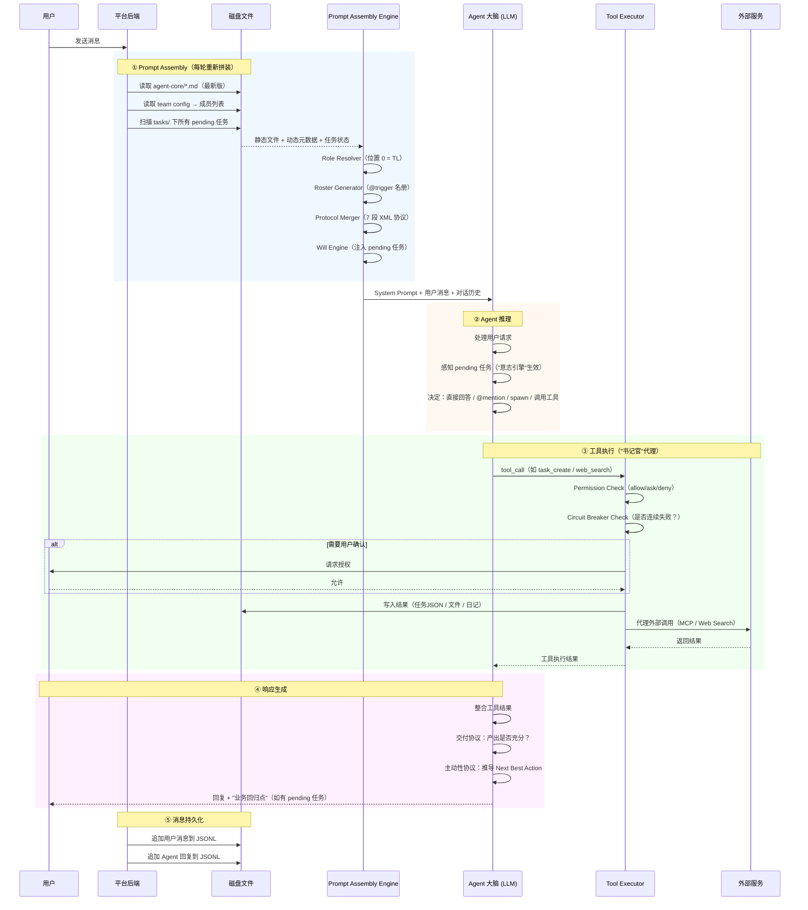
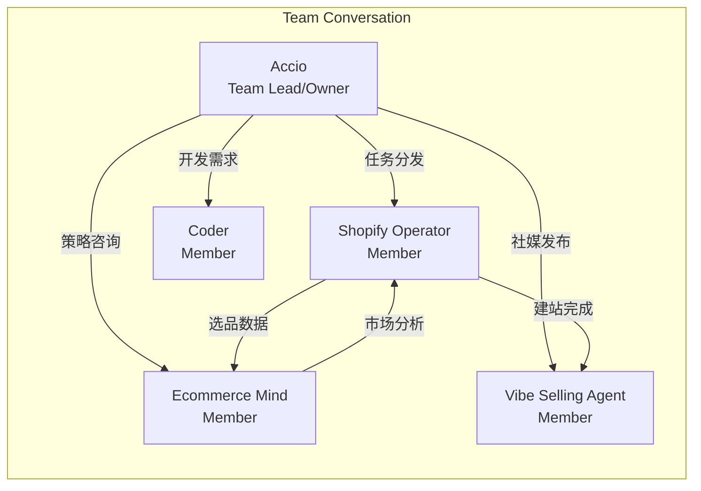
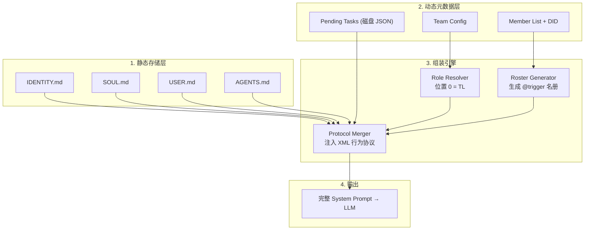
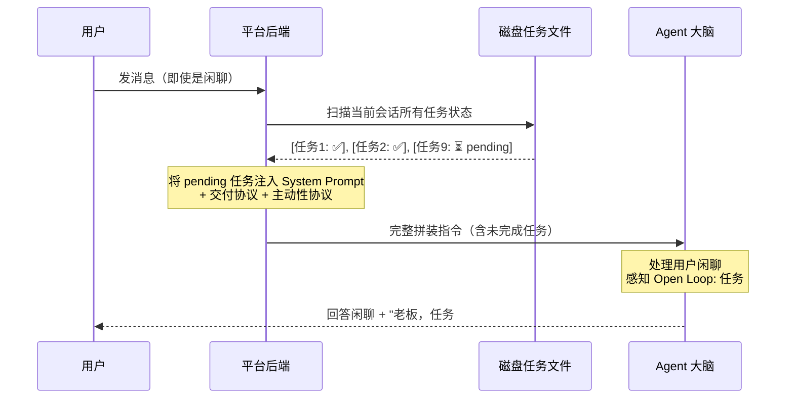
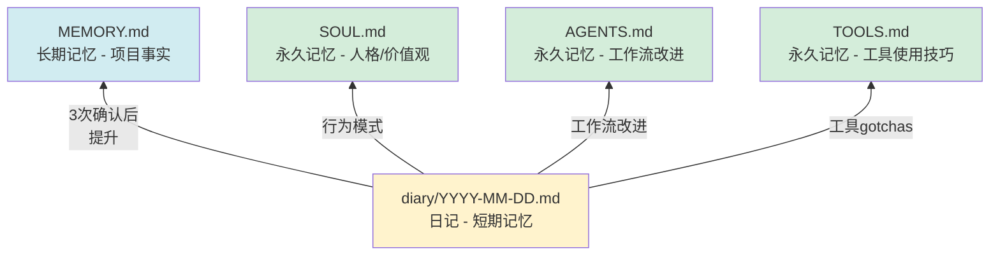

# Accio Work 逆向工程分析报告

> 分析版本: Accio Desktop v0.6.5 (beta channel)
> 分析日期: 2026-04-15
> 分析路径: `C:\Users\dongyu.li\.accio`

---

## 1. 架构总览

### 1.1 顶层目录结构

```
.accio/
├── accounts/                  # 多账号隔离
│   ├── 1754173417/           # 登录用户 (完整功能)
│   └── guest/                # 游客模式 (精简版)
├── bin/                      # 内置二进制工具
│   └── rg.exe                # ripgrep (代码搜索引擎)
├── logs/                     # SDK 日志 (滚动, 6 个文件, ~65MB)
│   ├── sdk.log               # 当前日志
│   └── sdk.log.1~5           # 历史滚动
├── network/                  # 网络启动快照
│   └── startup-*.json        # 每次启动的网络/代理诊断
└── plugins/                  # 全局插件 (目前为空)
```

### 1.2 账号级目录结构

```
accounts/1754173417/
├── agents/                   # 5 个 Agent + 消息队列
│   ├── DID-0D58EF-FA849A/   # Shopify Operator (核心电商Agent)
│   ├── DID-2799F4-428BC9/   # Ecommerce Mind (电商顾问)
│   ├── DID-CCA07A-BA9263/   # Vibe Selling Agent (社媒运营)
│   ├── DID-DB9653-765527/   # Coder (软件开发)
│   ├── DID-F456DA-2B0D4C/   # Accio (通用助手/Team Lead)
│   └── msg-queue/            # Agent 间消息队列
├── channels/                 # 频道 (空)
├── connectors/lark/          # 飞书连接器
├── conversations/            # 会话管理
│   ├── dm/                   # 1对1 对话
│   ├── team/                 # 团队对话
│   └── team-debug/           # 团队调试会话
├── mcp_oauth/                # MCP OAuth 凭证 (空)
├── pairings/                 # Agent 配对关系 (空)
├── permissions/              # 全局权限策略
├── plugins/                  # 插件目录
├── skills/                   # 共享 Skill 仓库
├── tasks/                    # 任务系统
└── workspaces/               # 工作空间会话
```

### 1.3 完整系统架构图

> 综合文件系统逆向 + UI 截图 + Agent 自述 + 实际 System Prompt 四个信息源

```mermaid
graph TB
    subgraph "① 用户交互层"
        UI["Desktop App UI (Electron)"]
        CLI["accio-mcp-cli"]
    end

    subgraph "② 网关层"
        GW["Local Gateway :4097"]
        PROXY["代理检测 / 网络路由"]
    end

    subgraph BACKEND["③ 平台后端 '书记官'层"]
        subgraph "Prompt Assembly Engine（每轮重新拼装）"
            RR["Role Resolver\n位置 0 = TL / 其余 = Member"]
            RG["Roster Generator\nDID → @trigger 名册"]
            PM["Protocol Merger\n7 段 XML 行为协议注入"]
            TI["Task Injector\n扫描 pending 任务 → 注入 prompt"]
            SL["Skill Metadata Loader\nL1 元数据始终注入"]
        end

        subgraph "Tool Executor（书记官代理）"
            TE["Tool Dispatcher"]
            CB["Circuit Breaker\n连续失败 2 次 → 强制重规划"]
            PERM["Permission Checker\nallow / ask / deny"]
        end

        subgraph "Delegation Router"
            MENTION["@mention 通道\n共享上下文 + 并行触发"]
            SPAWN["sessions_spawn 通道\n隔离上下文"]
            GA["group_activity 注入器\n成员回复 → XML → TL 上下文"]
        end

        COMPACT["Context Compactor\n上下文超限时压缩为 system_event 摘要"]
    end

    subgraph "④ Agent 大脑层（纯 LLM 推理）"
        LLM["System Prompt =\n静态 .md + 动态名册 + XML 协议\n+ pending 任务 + Skill L1 元数据"]
        A1["Accio (TL)"]
        A2["Shopify Operator"]
        A3["Ecommerce Mind"]
        A4["Coder"]
        A5["Vibe Selling Agent"]
        SUB["子 Agent\nexplore / bash / browser / general"]
    end

    subgraph "⑤ 能力层"
        SKILLS["Skills 技能系统\n80 业务 + 3 元技能\n三层加载: L1→L2→L3"]
        TOOLS["Tools 工具注册\n8 大类 30+ 内建工具"]
        MCP["MCP Servers\n150+ 外部工具"]
    end

    subgraph "⑥ 持久化层（文件系统即数据库）"
        CORE["agent-core/*.md"]
        CONV["conversations/\nJSONL 消息流"]
        TASKS["tasks/\n每任务一个 JSON"]
        DIARY["diary/"]
        CRONJ["cron/jobs.json"]
        SESS["sessions/\nAgent 会话 JSONL"]
        PROJ["project/ 工作区"]
        POLCY["permissions/ policy.jsonl"]
    end

    subgraph "⑦ 外部服务"
        SHOPIFY["Shopify API"]
        ALIBABA["Alibaba/1688"]
        GMAIL["Gmail API"]
        SOCIAL["Twitter / Instagram"]
        COMPOSIO["Composio MCP"]
    end

    %% 用户 → 网关
    UI --> GW
    CLI --> GW
    GW --> PROXY

    %% 网关 → Prompt Assembly（每轮触发）
    GW -->|"用户消息"| PM
    CORE -->|"读取最新 .md"| PM
    RR --> PM
    RG --> PM
    TASKS -->|"扫描 pending"| TI
    TI --> PM
    SKILLS -->|"L1 元数据"| SL
    SL --> PM
    CONV -->|"对话历史"| PM
    PM -->|"完整 System Prompt"| LLM

    %% Agent → 工具执行
    LLM -->|"tool_call"| TE
    TE --> CB
    TE --> PERM
    PERM -->|"allow"| TOOLS
    PERM -->|"ask → 用户确认"| UI
    TOOLS --> MCP
    MCP --> SHOPIFY & ALIBABA & GMAIL & SOCIAL & COMPOSIO
    SKILLS -->|"L2/L3 按需加载"| LLM

    %% 工具执行 → 持久化（书记官写入）
    TE -->|"task_create/update"| TASKS
    TE -->|"write/edit"| PROJ
    TE -->|"diary append"| DIARY
    TE -->|"message append"| CONV

    %% 委派路由
    LLM -->|"@DID 并行触发"| MENTION
    LLM -->|"sessions_spawn"| SPAWN
    MENTION -->|"激活"| A2 & A3 & A4 & A5
    SPAWN --> SUB
    A2 & A3 & A4 & A5 -->|"回复"| GA
    GA -->|"group_activity XML"| PM

    %% Cron + Compaction
    CRONJ -->|"定时触发"| GW
    CONV --> COMPACT
    COMPACT -->|"压缩摘要"| PM

    %% 待机旁听
    A2 & A3 & A4 & A5 -.->|"旁听（不消耗算力）"| CONV
```



**架构图设计说明**:
- **③ 平台后端是核心枢纽**: Agent 大脑（LLM）不直接接触磁盘、网络或其他 Agent，一切通过后端中转
- **实线 = 数据/控制流**: 表示实际的调用和数据传输
- **虚线 = 旁听**: Agent 可以"看到"团队对话（共享上下文），但不消耗算力，直到被 @mention 激活
- **Prompt Assembly 是每轮重入的**: 不是启动时组装一次，而是每轮对话前重新读取磁盘、重新拼装
- **Will Engine 分两层**: Task Injector 在后端（物理扫描 pending 任务），行为协议（交付/主动性）在 LLM 层（注入 System Prompt 后由 LLM 自行执行）

### 1.4 单轮请求生命周期（时序图）

以下展示用户发送一条消息后，系统内部的完整处理流程：



### 1.5 核心设计理念

Accio Work 的架构体现了以下核心设计理念:

1. **Prompt-as-Code**: 整个 Agent 行为完全由 Markdown 文件驱动，无需编写传统代码。IDENTITY.md、AGENTS.md、SOUL.md 等文件就是 Agent 的"源代码"
2. **文件系统即数据库**: 所有状态（会话、任务、权限、记忆）都以 JSON/JSONL/Markdown 文件持久化，无外部数据库依赖
3. **Skill-as-Plugin**: 技能是可热插拔的 Markdown 指令包，自带脚本和参考文档，Agent 根据 description 字段自动匹配和加载
4. **多 Agent 协作 = Team Chat**: Agent 之间的协作模拟了人类团队聊天模式（dm/team/team-debug）

---

## 2. Agent 体系

### 2.1 五个 Agent 角色分析

| Agent ID | 名称 | 角色 | 核心能力 | 工具集 |
|----------|------|------|---------|--------|
| DID-F456DA-2B0D4C | **Accio** | 通用日助手 / Team Lead | 日常任务、邮件、调度 | full |
| DID-0D58EF-FA849A | **Shopify Operator** | 电商建站教练 | 选品→上架→装修→营销→监控 | full |
| DID-2799F4-428BC9 | **Ecommerce Mind** | 电商领域专家 | 运营策略、品类分析、供应链 | full |
| DID-DB9653-765527 | **Coder** | 软件开发 Agent | 代码开发、调试、部署 | full |
| DID-CCA07A-BA9263 | **Vibe Selling Agent** | 社媒运营 Agent | 任务执行 + 社媒发布 | full |

**设计观察**:
- **Accio 是 Team Lead**: 拥有 cron 定时任务、是 team conversation 的 owner，负责协调和分发
- **Shopify Operator 最"富有"**: agent-core/skills/ 下有 22+ 个技能包，是功能最丰富的 Agent
- **角色分工清晰**: 每个 Agent 专注一个领域，但都有 `full` 工具权限，实际约束来自 prompt（IDENTITY + AGENTS）
- **DID 格式**: `DID-{6hex}-{6hex}`，类似去中心化标识符（Decentralized Identifier），但实际为本地生成的唯一 ID

### 2.2 Agent Core 文件体系

每个 Agent 的 `agent-core/` 是其"灵魂目录"，包含以下关键文件：

```
agent-core/
├── IDENTITY.md     # 身份: 名字、角色、沟通风格
├── AGENTS.md       # 行为: 具体任务的执行规范
├── BOOTSTRAP.md    # 引导: 启动时的初始化流程
├── HEARTBEAT.md    # 心跳: 周期性自检（大多为空）
├── MEMORY.md       # 记忆: 长期事实和上下文
├── SOUL.md         # 灵魂: 人格、价值观、行为准则
├── TOOLS.md        # 工具: 可用工具列表（运行时注入）
├── USER.md         # 用户: 用户信息模板
├── tool-registry.jsonc  # 工具注册配置
├── diary/          # 日记: 每日学习和反思
├── skills/         # 技能包目录
└── tool-results/   # 工具执行结果缓存
```

**各文件的设计意图**:

| 文件 | 类比 | 加载时机 | 核心用途 |
|------|------|---------|---------|
| IDENTITY.md | 名片 | 始终加载 | 名字、角色定位、沟通风格 |
| SOUL.md | 性格 | 始终加载 | 人格特质、价值观、防幻觉规则 |
| AGENTS.md | 工作手册 | 始终加载 | 详细的任务执行规范和工作流 |
| BOOTSTRAP.md | 启动清单 | 每次新会话 | 初始化步骤、开场白、前置检查 |
| HEARTBEAT.md | 心跳 | 周期性 | 定期自检（目前大多为空） |
| MEMORY.md | 长期记忆 | 需要时 | 项目事实、用户偏好、技术约定 |
| USER.md | 用户档案 | 始终加载 | 用户的 store URL、API token 等 |
| TOOLS.md | 工具箱 | 运行时注入 | 可用工具列表（由 tool-registry 驱动） |

**关键设计决策**:
- **SOUL.md 独立于 AGENTS.md**: 将"人格/价值观"与"具体任务规范"分离。SOUL.md 是稳定的，AGENTS.md 随任务变化。这允许同一个"灵魂"执行不同类型的任务
- **MEMORY.md 是"提升目标"**: self-improvement skill 中定义了从 diary 到 MEMORY.md 的"晋升"机制，只有经过验证的、反复出现的知识才会被提升到永久记忆
- **tool-registry.jsonc 与 TOOLS.md 分离**: 注册配置是结构化 JSON，运行时动态注入到 TOOLS.md。这意味着工具列表是声明式的，而非硬编码

### 2.3 Agent 创建向导（4 步流程）

用户可通过 UI 创建自定义 Agent，流程为 4 步向导（从模板到上线）：

| 步骤 | 名称 | 完成度 | 核心配置 |
|------|------|--------|---------|
| 第 0 步 | 选择起点 | — | 6 个模板：空白智能体、日常助手、Shopify 运营助手、Dropshipping 助手、编程助手、电商专家 |
| 第 1/4 步 | 身份与模型 | 20% | 名称、头像（像意风/冒险家/机器人/高雅黑/自定义上传）、描述、风格选择，右侧实时预览 |
| 第 2/4 步 | 工具 | 40% | 8 大工具类别独立开关（详见 §7.4），底部可配置默认工作区 |
| 第 3/4 步 | 技能 | 60% | 从全局技能目录选装（详见 §3.4），模板推荐技能自动预装 |
| 第 4/4 步 | 用户信息 | 80% | 称呼、偏好语言（默认中文）、备注、补充背景（职业/项目/偏好）|

**设计观察**:
- **模板 = 预设的身份 + 工具 + 技能组合**：选择模板后，后续步骤的默认值会相应变化
- **用户信息注入 Agent**: 第 4 步的信息会写入 `USER.md`，使 Agent 在对话时知道用户的称呼和背景
- **风格系统**: 头像不只是图片，而是有"风格"标签（像意风、冒险家、机器人、高雅黑等），暗示 Agent 的视觉和交互风格可能联动
- **完成并启动**: 最后一步直接进入对话，创建即可用，零配置代码

### 2.4 Agent 之间的关系



从 team conversation 配置可以看出:
- **Accio 是 owner**，其他 4 个是 member
- **每个 team 固定 5 个成员**，不支持动态增减（至少在当前版本）
- **Agent 之间通过 msg-queue 通信**，不直接调用
- **avatar 通过本地 HTTP 服务**: `http://127.0.0.1:4097/agents/{DID}/avatar`

### 2.5 System Prompt 运行时拼接流水线

> **来源**: 从 Accio（TL）自述获得的运行时机制，文件系统中不可见

System Prompt 不是静态文件，而是**每轮对话开始前由平台实时拼装**的。流水线分 4 层：



**三个核心组装模块**:

| 模块 | 输入 | 逻辑 | 产出 |
|------|------|------|------|
| **Role Resolver** | 成员列表 + 排列顺序 | `If (Agent_Index == 0) → 注入 TL 指令集; Else → 注入 Member 指令集` | 角色协议 |
| **Roster Generator** | 所有成员的 DID + 简述 | 遍历成员，提取 `IDENTITY.md` 核心描述，生成 `trigger: @{DID-xxx}` 语法 | 团队名册 |
| **Protocol Merger** | XML 行为协议模板 + 上述产出 | 将角色、名册、行为协议作为"补丁"合并到静态 prompt 中 | 最终 System Message |

**关键设计决策**:
- **"位置即权力"**: 不是由配置文件指定谁是 TL，而是**团队列表中第一位自动成为 TL**。把 Coder 移到第一位，下一轮他就是指挥官
- **每轮重新拼装**: 后端在每次用户发消息时实时读取最新 `.md` 文件，意味着修改 `SOUL.md` 后立即生效，无需重启
- **热插拔**: 修改团队成员列表、Agent 角色、行为规范，全部下一轮生效

---

## 3. Skills 技能体系

### 3.1 Skill 分类清单（Agent 已安装）

Shopify Operator Agent 安装了 22+ 个技能，按功能分类（从本地文件系统逆向获得）:

| 分类 | Skill 名称 | 功能 |
|------|-----------|------|
| **元技能** | self-improvement | 自我学习和反思系统 |
| | skill-creator | 创建和迭代优化新技能 |
| | skill-finder | 跨平台技能搜索和安装 |
| **电商核心** | shopify-builder | Shopify 建站自动化 |
| | shopify-developer | Shopify 开发辅助 |
| | shopify-dev-mcp | Shopify API 文档查询 |
| **选品/供应链** | product-selection | 选品工作流 |
| | market-insight-product-selection | 市场洞察选品 |
| | product-supplier-sourcing | 供应商搜索 (Alibaba) |
| | tariff-search | 关税计算和 HS 编码 |
| **内容/营销** | ecommerce-marketing | 营销编排器（路由到19个子技能）|
| | product-description-generator | 产品描述生成 |
| | review-summarizer | 评论摘要分析 |
| | social-media-publisher | 社媒发布 (Instagram/X) |
| **工具集成** | accio-mcp-cli | MCP 工具 CLI 封装 |
| | mcporter | MCP Server 管理 |
| | gmail-assistant | Gmail 操作 |
| **文档处理** | docx | Word 文档创建/编辑 |
| | pdf | PDF 处理 |
| | pptx | PPT 演示文稿 |
| | xlsx | Excel 电子表格 |

### 3.2 Skill 内部结构规范

```
skill-name/
├── SKILL.md              # [必需] 技能定义文件
│   ├── YAML frontmatter  # name, description, always_apply, region_scope 等
│   └── Markdown body     # 详细的使用说明和工作流
├── scripts/              # [可选] 可执行脚本
│   └── *.sh / *.py       # 自动化脚本（无需加载到上下文即可执行）
├── references/           # [可选] 参考文档
│   └── *.md              # 按需加载的深度文档
├── agents/               # [可选] 子 Agent 定义
│   └── *.md              # 用于 subagent 的角色定义
├── assets/               # [可选] 静态资源
│   └── *.html / *.json   # 模板、图标等
└── evals/                # [可选] 评估用例
    └── evals.json        # 测试用例定义
```

**三层渐进加载模型**（Progressive Disclosure）:

| 层级 | 内容 | 上下文大小 | 加载时机 |
|------|------|-----------|---------|
| L1: 元数据 | name + description | ~100 words | 始终在上下文中 |
| L2: SKILL.md body | 详细指令 | < 500 lines | 技能触发时 |
| L3: references/scripts | 深度文档和脚本 | 无限制 | 按需 Read |

**关键设计**: description 字段既是"触发器"也是"路由规则"。Agent 根据用户输入与 description 的语义匹配来决定是否激活某个 skill。skill-creator 特别强调 description 要"略带侵略性"（pushy），因为 LLM 倾向于"欠触发"（undertrigger）。

### 3.3 元技能分析

#### self-improvement（自我改进）

这是最具创新性的设计之一。核心机制:

1. **日记系统**: 每天一个 `diary/YYYY-MM-DD.md`，记录 4 种条目:
   - `[LRN]` 学习: 纠正、偏好、知识缺口、最佳实践
   - `[ERR]` 错误: 命令失败、API 异常
   - `[FEAT]` 功能请求: 用户需要但不存在的能力
   - `[REF]` 自我反思: 完成重要工作后的自我评估

2. **3 次确认机制**: 同一纠正出现 3 次时，询问用户是否永久化:
   - 确认 → 提升到 SOUL.md / MEMORY.md / AGENTS.md / TOOLS.md
   - 拒绝 → 标记为 case_by_case
   - 用户显式声明偏好 → 立即提升（跳过计数）

3. **提升目标分层**:
   - 行为模式 → SOUL.md
   - 工作流改进 → AGENTS.md
   - 工具使用技巧 → TOOLS.md
   - 项目事实/约定 → MEMORY.md

4. **学习到技能的萃取**: 当某个学习足够通用时，可以提取为独立的 skill

#### skill-creator（技能创建器）

这是一个"创造技能的技能"，其工作流:

1. **捕获意图**: 理解用户想要什么技能
2. **编写 SKILL.md**: 按规范填充 frontmatter + body
3. **创建测试用例**: 2-3 个真实的测试 prompt
4. **并行评估**: 同时运行 with-skill 和 baseline（无 skill / 旧版 skill）对比
5. **量化基准**: 使用 grading agent 评分，生成 benchmark.json
6. **可视化审阅**: 启动 HTML viewer 供人类审查
7. **迭代优化**: 根据反馈修改 skill，重复测试
8. **描述优化**: 专门的优化循环，提高 skill 的触发准确率

**子 Agent 分工**:
- `grader.md`: 评估断言是否通过
- `comparator.md`: 盲评 A/B 对比
- `analyzer.md`: 分析为什么一个版本优于另一个

### 3.4 全局技能目录（从 UI 截图确认）

创建 Agent 时可从全局技能目录中选装，6 大业务类别共 **80 个技能**：

| 类别 | 技能数 | 覆盖场景 |
|------|--------|---------|
| 货源与选品 | 9 | 1688/Alibaba 采购、关税查询、供应商评估 |
| 市场调研与分析 | 16 | 品类趋势、竞品分析、市场规模、受众画像 |
| 流量获取与广告 | 16 | Google Ads、Facebook Ads、SEO、社媒引流 |
| 内容创作与营销 | 17 | 产品描述、社媒帖子、邮件营销、视觉素材 |
| 数据分析与财务 | 8 | 利润计算、广告 ROI、财务报表、数据看板 |
| 客户生命周期与留存 | 14 | 客户分群、售后服务、复购策略、评论管理 |

**与 §3.1 的关系**:
- §3.1 是从 Shopify Operator 的 `agent-core/skills/` 目录逆向获得的**已安装技能**（22+ 个，含元技能）
- 本节是从 UI 截图确认的**全局技能目录**（80 个，纯业务技能）
- 全局目录不包含元技能（self-improvement、skill-creator、skill-finder），这些是系统级技能，不在选装列表中
- 每个 Agent 只安装其需要的子集，模板会推荐预装技能

**设计观察**:
- **80 个技能全部围绕跨境电商**，说明当前版本高度垂直化
- **6 个类别覆盖电商全链路**：选品 → 市场分析 → 流量获取 → 内容创作 → 数据分析 → 客户运营
- **技能目录与模板联动**：选择"Shopify 运营助手"模板时，相关技能自动预装

---

## 4. 团队协作机制

### 4.1 会话模型

```
conversations/
├── dm/                   # Direct Message (1对1)
│   ├── CID-*.jsonc       # 会话元数据
│   ├── CID-*.message_1.jsonl  # 消息流 (JSONL)
│   └── session_1.json    # 会话索引
├── team/                 # 团队对话
│   ├── CID-*.jsonc       # 包含 members 列表
│   └── CID-*.message_1.jsonl
└── team-debug/           # 团队调试
    └── CID-*/            # 每个会话一个目录
```

**DM 会话** (`conversations/dm/`): 用户与单个 Agent 1对1 交流，元数据中记录 `agentId`。

**Team 会话** (`conversations/team/`): 关键结构包含:
- `teamId`: 关联的 team 标识
- `teamName`: 如 "dev-team"
- `members[]`: 包含所有参与的 Agent，每个有 id/name/avatar/role/status/isAgent
- `path`: 会话绑定的项目目录
- `enableGenerativeUI`: 是否启用生成式 UI（目前为 false）

**设计特点**:
- 会话 ID 格式: `CID-{8位数字}U{13位时间戳}-{6hex}-{4位数字}-{6hex}`
- 消息存储为 JSONL（每行一条消息），支持高效追加
- DM 和 Team 共享相同的消息格式，但 Team 多了 members 管理

### 4.2 消息队列

`agents/msg-queue/` 目录用于 Agent 间异步消息传递。这是一个基于文件系统的简单消息队列，每个 Agent 可以向其他 Agent 发送消息。

### 4.3 任务系统

```json
// tasks/CID-{会话ID}/{序号}.json
{
  "id": "1",
  "subject": "水晶赛道市场趋势与受众分析",
  "description": "分析全球水晶及玄学类产品的流行趋势...",
  "status": "completed",        // pending | in_progress | completed
  "blocks": [],                  // 此任务阻塞哪些任务
  "blockedBy": [],              // 此任务被哪些任务阻塞
  "owner": "Ecommerce Mind",   // 负责的 Agent 名称
  "updatedAt": "2026-04-15T..."  // 最后更新时间戳
}
```

**任务系统特点**:
- 按会话分组（每个 team conversation 一个任务目录）
- 支持依赖关系（blocks/blockedBy）
- 任务分配给 Agent 的**名称**而非 ID
- 自增序号作为任务 ID
- 真实案例: 9 个任务用于"水晶电商"项目，分配给 Ecommerce Mind、Shopify Operator、Vibe Selling Agent

**"书记官"机制（Clerk Mechanism）**:
> **来源**: Agent 自述，文件系统中不可见

Agent 调用 `task_create` 时，**Agent 本身不操作磁盘**。平台后端的 Task Manager 模块（"书记官"）监听工具调用，在 Agent 回复的**同一毫秒**完成物理写入。这意味着：
- Agent 是纯逻辑层，不直接持有文件句柄
- 所有工具调用都经过平台后端中转
- 平台可以在写入前做校验、审计、权限检查

### 4.4 委派策略（Delegation Strategy）

> **来源**: TL 的实际 System Prompt 中的 `<delegation_strategy>` 协议

TL 有两条完全不同的委派通道：

| 通道 | 机制 | 适用场景 | 特点 |
|------|------|---------|------|
| **@mention** | `@{DID-xxx}` 触发团队成员 | 域内专家已在群聊中 | 共享上下文，成员"旁听"所有对话 |
| **sessions_spawn** | 创建独立子 Agent 会话 | 需要并行执行、上下文隔离、验证 | 独立上下文，不污染主会话 |

**@mention 规则（从实际 System Prompt 提取）**:
- 仅用于分配**新的具体任务**
- 不用于引用 Agent（用名字即可）、确认收到、或回复触发者
- 禁止暴露原始 Agent ID（如 `GID-...`），仅允许 trigger 语法

**sessions_spawn 可用的 Agent 类型**:
- `explore`: 代码/文件探索
- `bash`: Shell 命令执行
- `browser`: 网页浏览
- `general`: 通用任务
- `accio_work_guide`: 产品内置引导 Agent

**并行触发**: TL 可以在**一条消息中 @mention 多个 Agent**，它们并行执行、各自回复。实际案例中 TL 同时触发了 Ecommerce Mind、Shopify Operator、Vibe Selling Agent 三个专家并行调研。

**待机 vs 激活（计算成本模型）**:
- **待机（旁听）**: 所有团队成员始终共享对话上下文（Shared Context），能"看到"所有消息，但**不消耗推理算力**
- **激活（@mention）**: 只有被 TL 正式 `@{DID-xxx}` 触发的 Agent 才启动 LLM 推理，产生回复
- 这意味着 5 个 Agent 的团队，如果只触发 3 个，只消耗 3 份算力，而不是 5 份

**上下文注入机制**: 当团队成员回复时，平台通过 `<group_activity>` XML 标签将其他成员的发言注入到 TL 的下一轮上下文中：

```xml
<group_activity>
Other team members said since your last response:

[Ecommerce Mind (AI agent)]: 老板，针对玄学及水晶赛道的市场分析报告已完成...
[Shopify Operator (AI agent)]: 我在阿里巴巴上筛选了 3 家核心供应商...
[Vibe Selling Agent (AI agent)]: 品牌视觉风格建议为 "Modern Witch"...
</group_activity>
```

TL 看到的不是原始消息流，而是经过平台格式化的"群活动摘要"。这使得 TL 能在一轮中汇总所有专家的产出。

### 4.5 上下文管理与冲突解决

**上下文压缩（Context Compaction）**:
> **来源**: 对话实录 Part 7，`<system_event>` 标签

当对话历史超出 LLM 上下文窗口限制时，平台触发压缩机制：
- 通过 `<system_event>` 标签注入一段压缩摘要，替代原始的完整对话历史
- 摘要包含：项目状态、已完成任务、关键决策、当前待办
- Agent 在压缩后仍能基于摘要继续工作，但会丢失细节（如精确的对话措辞）
- 这解释了为什么任务要物理化到磁盘 JSON——即使对话被压缩，pending 任务仍能从磁盘重新加载

**最终一致性（Final Consistency）**:
> **来源**: team_architecture_and_mechanics.md §4.3

当两个专家给出矛盾的方案（例如定价建议不一致）时，TL 在最后的汇总环节根据**全局最优原则**进行裁决和修正。这不是自动化的——依赖 TL 的 LLM 推理能力在汇总时识别冲突并做出判断。

**Session 消息物理路径**:

Agent 的会话消息物理存储路径为：
```
agents/{DID}/sessions/{DID}_{CID}.messages.jsonl
```
例如 Accio 的 dev-team 会话：
```
agents/DID-F456DA-2B0D4C/sessions/DID-F456DA-2B0D4C_CID-54173417U1776219-8F8C3B-2844-F8CC89.messages.jsonl
```
这与 `conversations/` 下的消息流是**两套独立存储**——conversations 存的是用户视角的对话，sessions 存的是 Agent 视角的完整推理轨迹（含工具调用和结果）。

### 4.6 行为协议体系 — 七段 XML 协议

> **来源**: TL 实际 System Prompt 原文 + Agent 自述

Accio Work 通过 **7 个 XML 标签协议**控制 Agent 的全部运行时行为。这些协议在 Prompt Assembly 时由 Protocol Merger 注入：

| 协议标签 | 功能定位 | 核心规则 |
|---------|---------|---------|
| `<identity>` | 身份与沟通风格 | 匹配用户语言、结构化长回答、区分事实与推断 |
| `<doing_tasks>` | 任务处理方法论 | 5 种任务类型的标准处理流程（写作/调研/规划/分析/问答） |
| `<tone_and_style>` | 语气与格式规范 | 简洁直接不重复、GitHub Markdown、**Circuit Breaker: 工具连续失败 2 次 → 停止重规划** |
| `<task_management>` | 任务管理强制协议 | ≥3 个子任务必须创建 task、先 update 再输出、失败标 `[FAILED]`/`[BLOCKED]` |
| `<delegation_strategy>` | 委派策略 | sessions_spawn vs @mention 的使用时机（详见 §4.4） |
| `<tool_usage>` | 工具使用守则 | 专用工具优先于 exec、删除用回收站不用 rm、批量并行调用、**搜索优先原则** |
| `<delivering_results>` | 结果交付标准 | **文件优先原则**: 交付物默认写入文件、聊天里只放摘要和路径 |

**关键设计洞察**:
- **Circuit Breaker（熔断器）**: 工具连续失败 2 次自动停止并重新规划，防止 Agent 陷入死循环
- **NO EMPTY RESPONSES**: 每轮必须产出工具调用或文本，不允许空回复（消除"沉默"Agent）
- **文件优先 + 搜索优先**: 两条互补原则——产出物写文件（不靠聊天传递），外部数据先搜索（不靠内部知识编造）
- **身份保护**: 禁止透露底层模型名称，统一以"Accio Work AI 助手"对外

**关于 `<proactiveness>` 的说明**: Agent 自述中将"主动性"描述为与 `<delivering_results>` 和 `<task_management>` 并列的第三大行为支柱（详见 §4.7）。但在实际 System Prompt 原文中，`<proactiveness>` 并非独立的 XML 标签——它的行为（"预测下一步最佳行动"）分散在 `<delivering_results>`（交付导向）和 `<task_management>`（状态追踪）两个协议中。换言之，主动性是这两个协议叠加后的**涌现行为**，而非单独注入的指令。

### 4.7 "意志引擎" — Agent 目标持久化与蔡加尼克效应

> **来源**: Agent 自述 + 对话实录中的追问

这是 Accio Work 最精妙的设计之一。它解决了一个核心问题：**用户跑题 10 轮后，Agent 如何自动拉回正轨？**

**三大行为支柱**:

| 支柱 | 协议来源 | 行为表现 |
|------|---------|---------|
| **交付协议** (`<delivering_results>`) | 强制 Agent 每轮自审"是否产生了实质产出" | 纯聊天时会在结尾插入"要不要回到 XX 任务" |
| **主动性协议** (`<proactiveness>`) | 要求 Agent 预测"下一步最佳行动（Next Best Action）" | 任务标记 completed 后自动推导下一环节 |
| **任务协议** (`<task_management>`) | 强制将抽象目标转化为磁盘上的物理 JSON | 目标有了"物理实体"，不会随上下文窗口滑出而消失 |

**蔡加尼克效应（Zeigarnik Effect）的工程实现**:



**为什么有效**:
- 任务 JSON 存在磁盘上 → 不会随上下文压缩丢失
- 每轮对话前重新加载 pending 任务 → 形成"永久性未完成张力"
- 交付协议强制在回复结尾插入"业务回归点" → Agent 永远记得拉回主线
- 三者叠加 = **"逻辑重力"**：偏离越远，拉力越大

**对你产品的启示**: 这个模式是通用的，不依赖电商场景。任何多 Agent 协作系统都可以用"任务物理化 + 每轮注入 + 行为协议"来防止 Agent 偏航。

---

## 5. 定时任务系统

### 5.1 Cron 系统

定时任务存储在 Agent 的 `project/.accio/cron/` 目录:

```json
// project/.accio/cron/jobs.json
{
  "version": 2,
  "jobs": [{
    "id": "cron-{timestamp}-{random}",
    "name": "邮件分拣",
    "enabled": true,
    "deleteAfterRun": false,
    "schedule": {
      "kind": "cron",
      "expr": "0 9 * * 1,2,3,4,5"  // 工作日早上9点
    },
    "payload": {
      "kind": "agent",
      "message": "查看我的未读邮件...",
      "agent": "DID-F456DA-2B0D4C"
    },
    "state": {
      "nextRunAtMs": 1776301200000,
      "lastRunAtMs": 1776219422720,
      "lastStatus": "ok"
    },
    "target": {
      "type": "agent_sticky",
      "agentId": "DID-F456DA-2B0D4C",
      "boundConversationId": "CID-..."
    },
    "workspacePath": "...",
    "createdBy": { "source": "ui" }
  }]
}
```

**Cron 执行结果**: `project/.accio/cron/runs/cron-{id}.jsonl`，每次执行追加一行。

**设计特点**:
- 定时任务绑定到特定 Agent（`agent_sticky`）和特定会话
- 支持 cron 表达式
- payload 是"向 Agent 发送的消息"，而非直接执行脚本
- 运行结果以 JSONL 追加
- 可以从 UI 创建（`createdBy.source: "ui"`）

### 5.2 运行时状态

```json
// runtime/state.jsonc
{
  "agentId": "DID-F456DA-2B0D4C",
  "lifecycle": "offline",       // offline | online | busy 等
  "updatedAt": "2026-04-09T10:40:34.826Z"
}
```

---

## 6. 连接器体系

### 6.1 飞书连接器

```json
// connectors/lark/state.json
{
  "connectorId": "lark",
  "accounts": [],               // 未连接任何飞书账号
  "createdAt": 1775731233742,
  "updatedAt": 1776220090918
}
```

连接器是外部平台集成的标准化接口。目前只有飞书（Lark）连接器，但未激活。

### 6.2 Channels

`channels/` 目录为空。设计意图可能是：Channel 作为消息来源的抽象（如 Slack channel、Discord channel、飞书群），一个 Channel 可以路由到特定的 Agent 或 Team。

### 6.3 Pairings

`pairings/` 目录为空。推测用于 Agent-Channel 或 Agent-Connector 的绑定关系。

---

## 7. 权限模型

### 7.1 双层权限架构

权限在两个层级管理:

1. **账号级** (`accounts/{id}/permissions/policy.jsonl`): 全局策略，定义所有 Agent 共享的基线权限
2. **Agent级** (`agents/{DID}/permissions/policy.jsonl`): Agent 特定的权限覆盖

### 7.2 权限策略格式

```jsonl
{"type":"prefix","pattern":["cat"],"decision":"allow","bypassSandbox":true,"createdAt":"..."}
{"type":"prefix","pattern":["sudo"],"decision":"deny","createdAt":"..."}
{"type":"prefix","pattern":["rm"],"decision":"ask","createdAt":"..."}
{"type":"prefix","pattern":["git","reset"],"decision":"ask","createdAt":"..."}
```

**权限决策三档**:
- `allow`: 直接允许（可选 `bypassSandbox: true`）
- `ask`: 需要用户确认
- `deny`: 直接拒绝

**权限匹配**: 基于命令前缀模式匹配（`pattern` 数组）。`["git","reset"]` 匹配 `git reset` 开头的所有命令。

**安全分级设计**:

| 类别 | 策略 | 示例 |
|------|------|------|
| 只读命令 | allow + bypassSandbox | cat, ls, grep, pwd, date |
| 开发工具 | allow（沙箱内） | npm, pip, cargo, curl |
| 文件修改 | allow（沙箱内） | touch, mkdir, cp, mv |
| 危险操作 | ask（需确认） | rm, git reset, write, edit |
| 系统级操作 | deny | sudo, chmod, systemctl |
| Agent 专属工具 | allow | image_generate, sessions_spawn, mcp_call, cron, browser |

### 7.3 工具注册与权限正交

```
tool-registry.jsonc (注册层) → TOOLS.md (展示层) → policy.jsonl (权限层) → 执行
```

工具注册（声明 Agent 可以使用哪些工具）与权限（决定是否允许执行）是两个独立的维度。`tool-registry.jsonc` 支持:
- `preset`: 预设工具集（full/standard/developer/minimal/tl/none）
- `builtin.include/exclude`: 在预设基础上增删
- `mcp`: 注册 MCP 远程工具
- `conditional`: 条件注册（session 创建时求值）

### 7.4 完整工具类别体系（从 UI 截图确认）

创建 Agent 时可按类别开关工具，8 大类共 30+ 个内建工具：

| 类别 | 工具列表 | 设计定位 |
|------|---------|---------|
| **文件系统** | List, Read, Grep, Glob, Ripgrep, Write, Edit | 本地文件 CRUD，Ripgrep 由 `.accio/bin/rg.exe` 提供 |
| **网络与浏览** | Web Search, Web Fetch | 联网搜索和页面抓取 |
| **选品找商** | Product Supplier Search | 垂直电商工具（Alibaba/1688 搜索） |
| **代码与终端** | Bash, Process, Cron, Question | Shell 执行 + 进程管理 + **定时任务** + 用户交互 |
| **图像与媒体** | Image Generate, Image Edit, See Image | 生图 + 修图 + 视觉理解（多模态） |
| **实用工具** | Weather, Time, Location, Listen Emails, Unlisten Emails | 环境感知 + 邮件监听（推模式） |
| **记忆与规划** | Memory Search, Memory Get, Task Create, Task Get, Task Update, Task List | 长期记忆检索 + 任务 CRUD |
| **智能体协作** | Sessions Spawn, Sessions List, Sessions History, Sessions Send | Agent 间通信（基于 session 机制） |

**关键发现**:
- **Cron 是一等工具**：归在"代码与终端"类别，说明定时任务是 Agent 直接可调用的能力，不需要走外部调度
- **Question 工具**：让 Agent 主动向用户提问，实现双向交互而非单向指令
- **Listen/Unlisten Emails**：推模式邮件监听，Agent 可以"订阅"邮件事件而非轮询
- **Sessions 系列**：Agent 间协作的底层是 session 机制（Spawn 创建 → Send 发消息 → History 读历史 → List 查全部），不是直接消息传递
- **Memory Search vs Memory Get**：搜索（语义检索）和获取（精确读取）分离，暗示记忆系统有向量索引
- **See Image**：多模态视觉理解工具，Agent 可以"看图"分析

**与 §7.2 权限的关系**：工具类别的开关是注册层面的控制（Agent 是否"拥有"这个工具），权限策略是执行层面的控制（拥有后是否"允许"执行）。两者正交。

---

## 8. 插件系统

### 8.1 结构

```
accounts/{id}/plugins/
├── data/                 # 插件数据目录
├── installed/            # 已安装插件
└── remote-catalog-cache.json  # 远程插件目录缓存 (当前为空)
```

插件系统目前处于早期阶段，远程目录缓存为空数组。与 Skills 的区别在于: Skills 是 prompt 层面的能力扩展，Plugins 可能是更底层的运行时扩展。

### 8.2 Skill 远程目录

```
accounts/{id}/skills/
├── .preinstalled         # 预安装记录
└── remote_skills_cache.json  # 远程 Skill 目录缓存
```

`.preinstalled` 记录了首次安装的结果，显示 skill-creator、self-improvement、skill-finder、gmail-assistant、accio-mcp-cli 首次预装失败，后续通过其他方式安装成功。

---

## 9. 记忆系统

### 9.1 三层记忆架构



**设计哲学**:
- **diary** 是"工作记忆"，记录一切，按日期组织，支持 append-only
- **MEMORY.md** 是"长期记忆"，只保存经过验证的知识
- **SOUL.md** 是"核心人格"，最稳定，很少变化
- 提升机制保证了记忆质量: 只有反复验证的知识才会"晋升"

### 9.2 安全边界

self-improvement skill 明确禁止记忆以下内容:
- 凭证（密码、API key、token）
- 金融数据
- 医疗信息
- 第三方个人信息
- 位置模式

---

## 10. MCP 集成

### 10.1 架构

Accio Work 通过两种方式集成 MCP (Model Context Protocol):

1. **accio-mcp-cli**: 命令行工具，通过本地网关（:4097）调用 MCP 工具
2. **mcporter**: 通用 MCP Server 管理工具

### 10.2 MCP 工具发现

```
accio-mcp-cli toolkit              # 浏览所有工具集
accio-mcp-cli search twitter       # 搜索工具
accio-mcp-cli call post_tweet ...  # 调用工具
```

支持 150+ 工具，覆盖:
- **社交媒体**: Twitter、Instagram（通过 Composio）
- **邮件**: Gmail
- **办公**: Notion
- **支付**: Square
- **爬虫**: Apify
- **自定义 MCP Server**: 任意 HTTP/stdio MCP Server

### 10.3 认证机制

- 大部分 MCP 服务需要一次性 `start_*_auth` 调用
- Instagram 通过 Composio 代理，使用 session_id 维持状态
- `mcp_oauth/` 目录用于存储 OAuth 凭证（当前为空）

---

## 11. 网络和基础设施

### 11.1 本地网关

Accio Desktop 运行一个本地 HTTP 网关（端口 4097，备选 4098），提供:
- Agent avatar 服务
- MCP 工具代理
- 文件上传到 CDN（阿里 CDN: `sc02.alicdn.com`）

### 11.2 网络诊断

启动时记录完整的网络状态快照:
- 代理模式检测（系统代理、环境变量代理）
- 本地代理端口探测（7890、7891、1080 等常见代理端口）
- DNS 解析（Telegram API 等）
- 应用版本和 channel 信息

### 11.3 日志系统

SDK 日志采用滚动策略:
- 6 个日志文件（sdk.log + sdk.log.1~5）
- 每个文件约 10-12 MB
- 总共约 65 MB

---

## 12. Guest vs 登录用户

| 维度 | Guest | 登录用户 (1754173417) |
|------|-------|---------------------|
| Agent 数量 | 5 个（相同 DID） | 5 个（相同 DID） |
| agent-core 文件 | 完整（含 SOUL.md、USER.md） | 部分（无 SOUL.md/USER.md） |
| Skills | 无 | 22+ 个技能包 |
| Conversations | 无 | DM + Team |
| Tasks | 无 | 有任务系统 |
| Cron | 无 | 有定时任务 |
| Connectors | 无 | 飞书连接器 |

**观察**: Guest 账号像是 Agent 的"模板/种子"，登录后 Agent 被激活并获得 skills、conversations 等功能。两者共享相同的 DID，暗示 Agent 身份是全局的，但能力和状态是账号级的。

---

## 13. 关键设计模式总结

### 13.1 Prompt-as-Code
整个 Agent 行为由 Markdown 文件定义。不写一行传统代码就能：
- 定义 Agent 角色和人格（IDENTITY.md + SOUL.md）
- 编写复杂的多阶段工作流（AGENTS.md）
- 设置初始化流程（BOOTSTRAP.md）
- 管理长期记忆（MEMORY.md + diary/）

### 13.2 Skill 生态系统
三层加载（metadata → SKILL.md → references/scripts）+ 语义触发（description 匹配）+ 多平台发现（内部目录 + skills.sh + ClawHub + SkillsMP）= 一个完整的技能生态。

### 13.3 文件系统即数据库
所有状态以文件形式持久化:
- JSONL 用于消息流和审计日志（追加友好）
- JSONC 用于配置（支持注释）
- Markdown 用于 Agent 指令和记忆（人类可读）
- JSON 用于结构化数据（任务、cron、会话元数据）

### 13.4 安全沙箱模型
- 权限前缀匹配（allow/ask/deny 三档）
- 危险操作需要用户确认
- 系统级命令直接拒绝
- 工具注册与权限分离（注册 != 允许）

### 13.5 反幻觉设计
SOUL.md 中定义了严格的数据完整性规则:
- 源隔离: 不同工具的数据不混合
- URL 归属: 每个 URL 必须可追溯到源平台
- 图片验证: 只嵌入已验证的图片 CDN URL
- 禁止跨源捏造: 找不到就说找不到，不自动替换

### 13.6 渐进式能力获取
Agent 的能力是逐步获取的:
1. 基础能力: tool-registry preset（full/standard/minimal）
2. 技能扩展: 安装 skill 到 agent-core/skills/
3. 外部集成: MCP 工具连接
4. 自我进化: self-improvement diary → 提升到永久记忆 → 提取为新 skill

### 13.7 每轮实时拼装的 System Prompt
System Prompt 不是静态模板，而是每轮对话前由后端从磁盘实时组装的:
- 读取最新的 agent-core/*.md 文件（修改即生效，无需重启）
- 动态计算团队名册和角色（位置 0 = TL，热插拔）
- 注入 7 段 XML 行为协议（模块化组合）
- 加载 pending 任务状态（意志引擎的基础）

### 13.8 意志引擎（蔡加尼克效应的工程化）
防止 Agent 偏航的三层保障:
- **物理层**: 任务以 JSON 文件持久化到磁盘，不随上下文窗口滑出而丢失
- **注入层**: 每轮对话前将所有 pending 任务注入 System Prompt，形成"未完成张力"
- **协议层**: `<delivering_results>` 强制结果导向 + `<proactiveness>` 强制推导下一步 → 偏离越远拉力越大

### 13.9 委派双通道
两种完全不同的 Agent 间通信机制:
- **@mention**: 触发已在群聊中的团队成员，共享完整上下文（"旁听"模式）
- **sessions_spawn**: 创建独立子 Agent 会话，上下文隔离，适合并行和验证场景
- 选择依据: 需要共享上下文 → @mention; 需要隔离/并行 → spawn

### 13.10 "书记官"分离（Agent ≠ 执行器）
Agent 不直接操作磁盘/网络，所有工具调用由平台后端中转:
- Agent 调用 `task_create` → 后端 Task Manager 写入 JSON
- Agent 调用 `web_search` → 后端代理请求
- 好处: 审计、权限检查、熔断（Circuit Breaker: 连续失败 2 次 → 强制重规划）都在后端实现，Agent 保持纯逻辑层

### 13.11 待机旁听 + 并行触发
- 团队成员始终共享上下文（旁听），但**只有被 @trigger 才消耗推理算力**
- TL 可在单条消息中 @mention 多个 Agent → 并行执行 → TL 通过 `<group_activity>` 一次性汇总所有产出
- 5 人团队触发 3 人 = 3 份推理成本，而非 5 份

### 13.12 上下文压缩 + 任务物理化联动
- 对话超限时平台自动压缩为摘要（`<system_event>`），细节丢失
- 但 pending 任务已物理化到磁盘 JSON → 压缩后仍能从磁盘重新加载
- 这是任务物理化的**第二重意义**：不仅防偏航，还防压缩后的信息丢失

### 13.13 最终一致性（TL 裁决）
- 多个专家并行执行时可能产出矛盾方案
- 冲突不自动解决——TL 在汇总环节基于全局最优原则进行裁决
- 这是"人类式团队协作"的忠实模拟：分头调研 → 汇报 → 领导拍板

### 13.14 双轨存储（conversations vs sessions）
- `conversations/` 存用户视角的对话（消息流）
- `sessions/` 存 Agent 视角的完整推理轨迹（含工具调用和结果）
- 同一次交互产生两份记录，分别服务于用户回看和 Agent 上下文恢复
