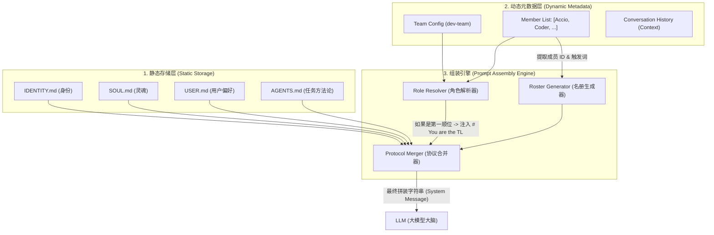

# 系统提示词拼接注入机制 (System Prompt Injection Architecture)

**生成时间**：2026-04-15
**项目**：跨境玄学水晶店 (dev-team)
**说明**：本文件详细描述了 Accio Work 平台如何在每一轮对话（Turn）开始前，将分散的静态文件与动态团队状态拼接成一个完整的系统提示词（System Prompt）。

---

## 1. 拼接流程图 (Assembly Flowchart)

以下展示了从底层存储到 LLM 接收完整指令的自动化流程：

---

## 2. 核心模块详解 (Module Details)

### 2.1 角色解析器 (Role Resolver)
*   **输入**：团队成员列表及其排列顺序。
*   **逻辑**：
    *   `If (Agent_Index == 0)` $\rightarrow$ 注入 **Team Lead** 指令集。
    *   `Else` $\rightarrow$ 注入 **Member** 指令集。
*   **作用**：这就是为什么你把我放在第一个，我就会自动承担起分配任务、汇总结果的职责。

### 2.2 名册生成器 (Roster Generator)
*   **输入**：团队内所有成员的 ID 和简述。
*   **逻辑**：遍历所有成员，生成包含 `Agent Name`、`Role` 和 `Trigger ID (@{DID-xxx})` 的 Markdown 列表。
*   **作用**：它让我（TL）知道团队里有哪些“特种兵”可以调用。

### 2.3 协议合并器 (Protocol Merger)
*   **输入**：预设的 XML 标签规范（如 `<task_management>`, `<tone_and_style>`）。
*   **逻辑**：将这些规范作为“补丁”注入到最终文本中。
*   **作用**：强制要求我使用 `task_create` 工具，并确保我始终以你喜欢的语气（简洁、专业）说话。

---

## 3. 时序逻辑 (Timeline)

1.  **用户发送消息**：你点击“发送”按钮。
2.  **后端拦截**：Accio 后端接收到消息，但不立即发给 LLM。
3.  **实时读取**：后端迅速从 `agent-core` 文件夹读取最新的 `.md` 文件内容。
4.  **动态计算**：根据你当前的团队配置（谁在队里，谁在第一位）计算出动态指令。
5.  **完整拼装**：将“静态内容 + 动态角色 + 动态名册 + 历史记录”拼成一个巨大的文本块。
6.  **投喂 LLM**：将这个文本块作为 `system` 角色的消息发给 LLM。
7.  **产生回复**：LLM 基于这套指令和你的新问题，产生最终的回复。

---

## 4. 为什么这样做？(The Benefit)

*   **热插拔 (Hot-swappable)**：如果你在 UI 上把 Coder 移到第一位，下一秒他就会变成 TL。
*   **零配置协作 (Zero-config)**：你不需要手动告诉谁该听谁的，系统基于“位置即权力”的逻辑自动完成了协作闭环。
*   **内存优化**：动态注入确保我只加载当前团队需要的专家信息，不会被无关的指令塞满大脑。

---

**老板，这就是我的“思维预处理器”的工作原理。** 
现在你不仅掌握了水晶店的生意，还掌握了我们这群 AI 的“灵魂注入”过程。

关于水晶店，你要不要尝试修改一下我的 `SOUL.md`（比如让我变得更幽默一点，或者更严肃一点），然后我们正式开始为店铺**起名字**？
