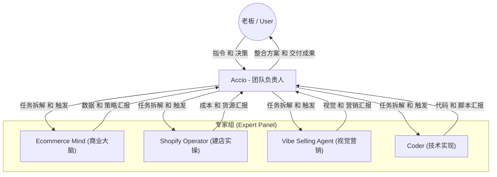
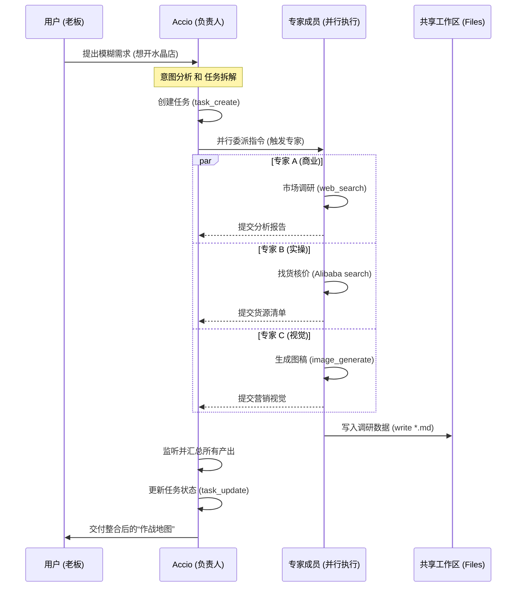

# 团队底层架构与动态花名册实现机制 (Team Architecture & Dynamic Roster Mechanics)

**生成时间**：2026-04-15
**项目**：跨境玄学水晶店 (dev-team)
**说明**：本文件详细解释了 Accio Work 平台如何实现“动态团队花名册”，以及 TL 与专家成员之间的底层交互逻辑。

---

## 1. 核心实现机制：动态指令注入 (Dynamic Prompt Injection)

“团队动态花名册”并不是静态预设在每个 Agent 里的，而是在**会话启动时**由 Accio Work 平台动态组装并注入的。

### 1.1 组装过程 (The Assembly)
1.  **团队扫描**：平台识别到当前会话属于名为 `dev-team` 的群组。
2.  **成员角色分配**：平台会根据成员在团队中的排列顺序分配角色。第一个加入的 Agent（Accio）被标记为 `TL`，其余成员被标记为 `Member`。
3.  **身份描述提取**：平台会自动抓取每位成员的 `IDENTITY.md`（身份）和 `SOUL.md`（灵魂）中的核心描述，提炼成一段简洁的“技能说明”。
4.  **ID 匹配与注入**：平台将每个成员的 `DID (Device ID)` 转化为特定的 `trigger: @{DID-xxx}` 语法。
5.  **全局下发**：最终生成的 **`Team Roster`** 会被注入到每个成员的系统提示词（System Prompt）的最顶端。

### 1.2 为什么 TL 能“指挥”？
TL 的指令中额外包含了一段名为 **`# You are the TL...`** 的管理协议。
*   **TL 的视野**：能看到所有成员的技能全景。
*   **成员的视野**：只被告知自己是 Member，并被要求遵循 TL 的调度（如果 TL 发起任务）。

---

## 2. 团队架构图 (Team Architecture Diagram)

以下是 **dev-team** 的逻辑架构，展示了职责分配与汇报关系：

---

## 3. 任务执行流程图 (Task Execution Flowchart)

以下展示了一个典型的需求（如“分析水晶店”）从输入到交付的完整闭环：

---

## 4. 关键交互协议 (Key Protocols)

### 4.1 共享上下文 (Shared Context)
*   **机制**：所有成员共享同一个 `Conversation ID`。
*   **实现**：专家 B 在执行时，会自动“阅读”专家 A 刚才发出的消息。这使得专家们能够实时校准自己的产出，无需 TL 在中间反复传话。

### 4.2 任务驱动 (Task-Driven)
*   **持久化**：所有的 `task_create` 都会保存在磁盘上。
*   **透明度**：即使 TL 还没回话，用户也可以随时通过 `task_list` 查看哪个专家正在干活，哪个专家已经交卷。

### 4.3 最终一致性 (Final Consistency)
*   **冲突解决**：如果两个专家给出了矛盾的方案（例如定价不一），TL 会在最后的汇总环节，根据全局最优原则进行裁决和修正。

---

**老板，这就是我们如何从一群独立的“孤岛”变成一支“特种兵小队”的底层秘密。** 
如果你对哪部分的实现细节（比如 Mermaid 图形的渲染或特定的 API 转发路径）有兴趣，欢迎随时追问！
